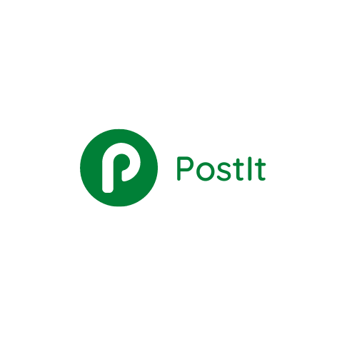

<div align="center">

  
  <h1>PostIt</h1>
  
  <p>
    A social media Application that helps you explore and connect with people having similar interests like you! 
  </p>
  
  
<!-- Badges -->

  
	
	
	
	
	
  
	
	
	
	
	
	
	
	
	
	
	


https://user-images.githubusercontent.com/71656941/199233873-86f95080-a9d5-4443-b280-464ca482d96e.mp4


   
<h4>
    <a href="https://user-images.githubusercontent.com/71656941/199233873-86f95080-a9d5-4443-b280-464ca482d96e.mp4">View Demo</a>
  <span> · </span>
    <a href="">Documentation</a>
  <span> · </span>
    <a href="">Report Bug</a>
  </h4>
</div>

<br />

<!-- Table of Contents -->
# :notebook_with_decorative_cover: Table of Contents

- [About the Project](#star2-about-the-project)
  * [Tech Stack](#space_invader-tech-stack)
  * [Features](#dart-features)
  * [Screenshots](#camera-screenshots)
  * [Environment Variables](#key-environment-variables)
- [Getting Started](#toolbox-getting-started)
  * [Installation](#gear-installation)
  * [Run Locally](#running-run-locally)
  * [Deployment](#triangular_flag_on_post-deployment)
- [Roadmap](#compass-roadmap)
- [What I Learnt](#what-i-learnt)
  

<!-- About the Project -->
## :star2: About the Project

<!-- TechStack -->
### :space_invader: Tech Stack

<details>
  <summary>Client</summary>
  <ul>
    <li><a href="https://reactjs.org/">React.js</a></li>
    <li><a href="https://tailwindcss.com/">TailwindCSS</a></li>
  </ul>
</details>

<details>
  <summary>Server(CMS)</summary>
  <ul>
    <li><a href="https://www.sanity.io/">Sanity</a></li>
  </ul>
</details>

<!-- Features -->
### :dart: Features

- Google Identity Service - Login
- Masonry Layout Pins Display
- Pin Download, Deletion, Saving, Saveing Status, Description Link
- Pin Comment and Similar Category Pin Suggestion
- Search based on Post name, comment, category, etc.
- User Profle sharing user's acitivity, liked, commented and shared Pins 

<!-- Screenshots -->
### :camera: Screenshots

<div align="center"> 
  <!-- -->
</div>

<!-- Env Variables -->
### :key: Environment Variables

To run this project, you will need to add the following environment variables to your .env file

`REACT_APP_GOOGLE_API_TOKEN`

`REACT_APP_SANITY_PROJECT_ID`

`REACT_APP_SANITY_TOKEN`

<!-- Getting Started -->
## 	:toolbox: Getting Started

<!-- Installation -->
### :gear: Installation

This Project has the following installations:

- 
   

<!-- Run Locally -->
### :running: Run Locally

Clone the project

```bash
  git clone https://github.com/SAHU-01/PostIt.git
```

Go to the client directory

```bash
  cd client
```

Install dependencies

```bash
  npm install
```

Start the client

```bash
  npm start
```

Go to the server directory

```bash
  cd server
```

Install dependencies

```bash
  npm i sanity
```

Start the client

```bash
 sanity start
```

Check the Databas by

```bash
 sanity manage
```

<!-- Deployment -->
### :triangular_flag_on_post: Deployment

This Project is Deployed on Netlify

<a href="https://positit.netlify.app/">Visit Here</a>

<!-- Roadmap -->
## :compass: Roadmap

* [x] Todo : LogOut Feature Addition
* [ ] Todo : Improve Site SEO
* [ ] Todo : Improve Load Time and implement data optimization for smooth user experience

<!-- What I Learnt -->
## What I Learnt

* Google Identity Services Login
* Sanity CMS
* Masonry Layout
* React Routing - react router dom v6
